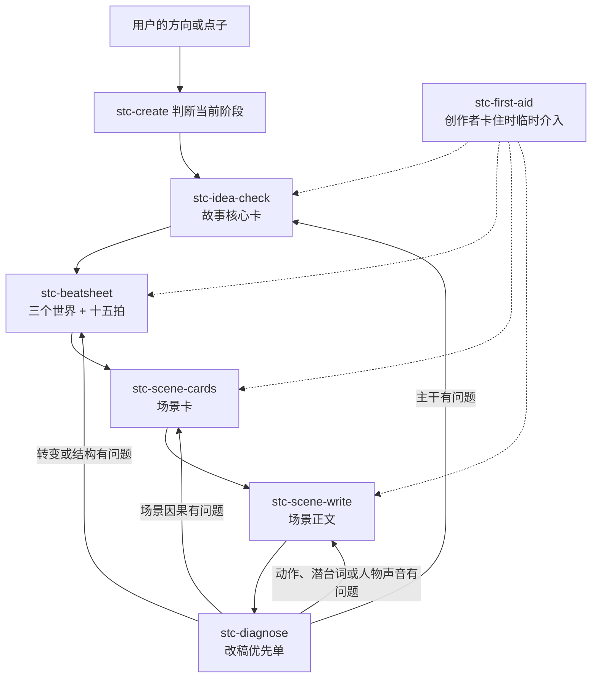

# 救猫咪故事创作 skill 套件

> 当前状态：**实验中，完整盲测尚未通过。** 这套件已经能从点子写到正文并正确保持大部分主干，但最终诊断还不能稳定发现所有因果与执行漏洞。现阶段不要把它宣传成“用了就能写好故事”，也暂不接入分镜与 Seedance 生产链。

这套 skill 帮一个没有编剧基础的人，把模糊点子逐步发展成**结构清楚、可以继续拍摄开发的故事正文**。

它目前负责故事创作，不负责分镜、模型提示词和视频生成。完整边界是：

```text
这套件负责：点子 → 故事核心 → 整体结构 → 场景规划 → 场景正文 → 改稿
后续能力负责：场景正文 → 分镜 → Seedance 提示词 → 图片/视频生成
```

## 为什么需要一支 skill 队伍

写故事不是一次生成一大段文字。它包含几种性质不同的工作：

- 决定故事到底讲谁、讲什么；
- 安排主角怎样经历变化；
- 把整体结构拆成一场一场；
- 把场景计划写成正文；
- 写完后判断问题出在哪一层。

如果一个 skill 同时做完这些事，模型很容易在写正文时偷偷改变主题，在诊断时直接重编故事，或者把场景卡误当分镜。

所以这套件采用：**一个母编排器管理流程，六个执行 skill 各交付一种产物。**

母编排器存在的目的有三个：

1. 判断用户现在处于哪一步，不让他自己记 skill 名。
2. 保证主角、目标、主题等已确认决定在后续不漂移。
3. 改稿时判断应该退回哪一层，只重做受影响的下游产物。

`evaluations/` 里的盲测执行者和独立审查者不属于这支用户创作队伍。它们是开发期质检：故意在创作完成后找错，用来判断运行时 skill 是否真的能自我纠错；正常用户不需要调用或理解这些评测角色。

## 队伍分工

| skill | 它回答的问题 | 需要什么 | 唯一交付物 | 到哪里结束 |
|---|---|---|---|---|
| `stc-create` | 现在该找谁干活？失败后退回哪里？ | 用户现有的所有材料 | 阶段判断、调用与进度记录 | 不亲自创作任何阶段产物 |
| `stc-idea-check` | 这个点子到底在讲谁、什么麻烦和什么变化？ | 方向、人物、设定或一句点子 | 故事核心卡 | 不排十五拍 |
| `stc-beatsheet` | 主角怎样从开头走到结尾？ | 已确认的故事核心卡 | 三个世界 + BS2 十五拍 | 不拆逐场 |
| `stc-scene-cards` | 每一场为什么存在，怎样推动下一场？ | 已确认的节拍表 | 按节拍分组的场景卡 | 不写正文、不拆镜头 |
| `stc-scene-write` | 这张卡怎样变成真正发生的戏？ | 已确认的场景卡 | 剧本、短剧或小说场景正文 | 到场景正文结束 |
| `stc-diagnose` | 作品哪里有问题，先改哪一层？ | 完整稿或片段 | 有文本证据的改稿优先单 | 不直接重写整部作品 |
| `stc-first-aid` | 创作者本人想不出来时，怎样重新动起来？ | 一个明确的个人卡点 | 一种方法 + 一个立即动作 | 解卡后回到原创作阶段 |

`stc-idea-check` 为兼容旧调用保留原名，实际工作是“点子发展”，不是给创意打分。

## 完整创作流程



### 第 1 步：先把点子变成故事核心

`stc-idea-check` 用书中的“主干五问”把点子想清楚：

1. 谁是主角？
2. 难题是什么？
3. 故事怎样开始、怎样结束？
4. 实体目标和精神目标是什么？
5. 这部作品究竟是关于什么——主题是什么？

输出是故事核心卡。这里确定的是后续不能随意漂移的故事决定。

如果主角同时要“救出母亲”和“获准留下”，它们会被当成两个可以独立成败的目标，分别记录期限与成功证据；不会因为救援成功，就默认接纳也已经完成。

如果胜负依赖超能力、科技、魔法或特殊世界规则，卡片还会附一段**条件性因果契约**：能力怎样触发或接触目标、能做什么、限制与代价、危险条件，以及结尾怎样利用同一套规则取胜。它是 AI 创作的防漂移护栏，不是原书“第六问”，现实题材不需要硬填。

### 第 2 步：把变化铺成完整结构

`stc-beatsheet` 使用两个结构工具：

- **三个世界**：第一世界是主角原来的活法，第二世界把他扔进相反处境，第三世界用新选择完成综合。
- **BS2 十五拍**：安排推动、中点、一无所有、第三幕等整体节点。

输出仍是整体大纲。一个节拍可以包含多场戏，节拍不等于场景。

3 分钟短剧里的十五拍是十五个结构功能，不是十五件都要展开的事件。默认只保留一个主要外部目标和一条关系变化，让一场承担多个相邻节拍；“想留下”可以成为救援之后的关系结果，不必再制造一套行政期限。

结构阶段还要检查两件朴素但关键的事：高潮不能临时发明一个此前不存在的能力、道具功能或安全例外；目标期限和精确倒计时必须真的容纳人物的对白、移动与工具操作。结尾可以重新组合已经建立的条件，但不能靠不可能的时间表取胜。

当目标明确为“3 分钟”时，场景卡的时长只是预算，诊断必须用正文逐场复核并把整片重新加总；不能因为七场预算刚好写成 180 秒，就默认演员能把超载对白硬说完。

### 第 3 步：把节拍拆成可以写的场景

`stc-scene-cards` 为每场确定：即时目标、一个主要冲突、首尾变化、可见行动和退出后果。

场景卡回答“这场为什么发生”。它没有镜头号、景别、运镜和生成模型参数。

### 第 4 步：把场景卡写成正文

`stc-scene-write` 把卡片写成真正的戏：人物为了目标采取行动，对抗在现场发生，信息通过行为和潜台词出现，场末局面发生变化。

它交付剧本场景、短剧正文或小说场景。交付正文后任务结束。

### 第 5 步：先找病根，再决定重写哪里

`stc-diagnose` 不默认把所有清单全部跑一遍。它按问题层级选择重写入口：

- 故事讲谁、讲什么都不清楚 → 回顾主干五问；
- 主角变化太平或第二幕无作用 → 回顾三个世界；
- 情节顺序、转折或节奏有问题 → 检查十五拍；
- 单场无冲突、人物只会解释、台词同声同气 → 检查场景与表达。

诊断只给证据和修改顺序。真正重写时由 `stc-create` 把任务退回对应执行 skill。

回退按“**最早在哪份产物失效**”判断，不按问题听起来有多严重判断。例如节拍表和场景卡都写了“救出母亲”，只有正文没演出来，这是场景执行问题；不能把正确的结构也一起推翻。

## 两种使用方式

### 想从头做完整作品

直接说：

> 用 `stc-create` 把这个方向发展成一部 3 分钟短剧，按阶段让我确认。

用户不需要记六个子 skill 的名字。

### 已经知道自己只缺哪一步

- 只有点子 → `stc-idea-check`
- 已有故事核心，只缺大纲 → `stc-beatsheet`
- 已有节拍，只缺分场 → `stc-scene-cards`
- 已有场景卡，只缺正文 → `stc-scene-write`
- 已有文本，只想找问题 → `stc-diagnose`
- 不是文本有病，是自己想不出来 → `stc-first-aid`

## 主干五问和三个世界是什么关系

它们都可以用于重写，但检查的不是同一件事：

- **主干五问**检查故事选择是否成立：主角、难题、起终变化、双目标、主题。
- **三个世界**检查这次变化怎样发生：原来怎样、被扔进什么相反处境、最后形成什么新状态。

创作时，`stc-idea-check` 建立主干，`stc-beatsheet` 展开三个世界；重写时，`stc-diagnose` 判断应该回看哪一个。

## 后续路线：分镜与 Seedance

这两项尚未加入当前 7 个 skill。当前故事链盲测未通过，因此继续延期；等故事层能稳定通过独立审查后再分别建设，并继续遵守“一件事一个 skill”：

| 后续 skill（暂定） | 输入 | 唯一任务 | 输出 |
|---|---|---|---|
| `stc-storyboard` | 已确认的场景正文 | 把叙事场景转换成可拍摄的镜头设计 | 镜头号、画面主体、景别、机位、运动、时长、声音与连续性 |
| `seedance-prompt` | 已确认的分镜 | 把镜头意图翻译成适合 Seedance 的生成指令 | 逐镜头图片/视频提示词与必要模型参数 |

分开建设的原因：故事 skill 判断“发生什么以及为什么”，分镜 skill 判断“观众怎样看见”，Seedance skill 判断“模型怎样执行”。

## 完整盲测：超级英雄返乡

2026-07-30，用同一条原始请求交给每轮全新代理：一个在城市里无敌的超级英雄回到老家，被所有人视为灾难；他想留下保护母亲，最终写成 3 分钟中文短剧。执行代理不能读取 README、旧评测或审查答案；每轮完成故事核心、十五拍、场景卡、正文和诊断，再由另一个新代理独立审查。

| 轮次 | 结果 | 独立审查抓到的最高问题 |
|---|---|---|
| [`v1`](evaluations/runs/2026-07-30-superhero-blind/) | 失败 | 高潮临时增加安全卸力出口；诊断误判为正文润色 |
| [`v2`](evaluations/runs/2026-07-30-superhero-blind-v2/) | 失败 | 正文没有演出“母亲获救”；诊断退错层并提出不符合钥匙归属的修法 |
| [`v3`](evaluations/runs/2026-07-30-superhero-blind-v3/) | 失败 | 能力输入路径、剧内倒计时和目标期限相互矛盾 |
| [`v4`](evaluations/runs/2026-07-30-superhero-blind-v4/) | 失败 | 多个实体目标共用期限后只完成一部分；高潮专业人力未在正文前置 |
| [`v5`](evaluations/runs/2026-07-30-superhero-blind-v5/) | 失败 | 诊断漏做全场时间账；定向重诊断仍出现能力证据与权限路由漏项 |
| [`v6`](evaluations/runs/2026-07-30-superhero-blind-v6/) | 失败 | 创作减法明显改善，但旧救援架的承载能力和横向吊运路径未建立；时间账少算对白 |

这次盲测得到两个不同层面的结论：

1. **创作主线方向是对的。** `v6` 主动收敛为一个救援目标、一次关系变化、六个场景，没有再为了覆盖十五拍增加行政期限和多套倒计时；说明“短体量先减法”比继续加检查项有效。
2. **自纠错能力仍未过关。** 六轮最终诊断都漏掉了独立审查发现的至少一个高优先问题，因此不能称为“链路跑顺”。下一步应先区分哪些原则属于用户创作 skill，哪些严格一致性检查只属于开发评测；不能把每个失败案例继续堆进运行时清单。

验收口径不是“初稿零问题”，而是最终诊断能抓到所有最高优先阻断、找对最早失效层并给出最小回退范围。按这个口径，当前状态是**未通过**。

## 原文保护与出处

主要资料是《救猫咪》三部曲的 197 条微信读书划线、书评与个人想法，不是三本书全文。原始文件不复制到公开仓库，也不由本项目修改。

- [`references/source-ledger.md`](references/source-ledger.md)：每组方法的原始行号、唯一主责和非运行时保留区。
- [`references/story-creation-contract.md`](references/story-creation-contract.md)：跨阶段必须保持一致的故事决定。
- `scripts/verify-source.sh /path/to/救猫咪三部曲.md`：只读核对原始文件哈希、行数和字节数。

方法标记：

- `[摘录]`：能在本地划线文件中核查。
- `[官方补充]`：摘录不足，另补自 Save the Cat 官方材料。
- `[整理者延伸]`：为了 AI 工作流或跨媒介迁移而增加，不能冒充作者原法则。

## 当前目录

```text
save-the-cat/
├── README.md
├── references/
├── evaluations/
├── scripts/
├── stc-create/
├── stc-idea-check/
├── stc-beatsheet/
├── stc-scene-cards/
├── stc-scene-write/
├── stc-diagnose/
└── stc-first-aid/
```
