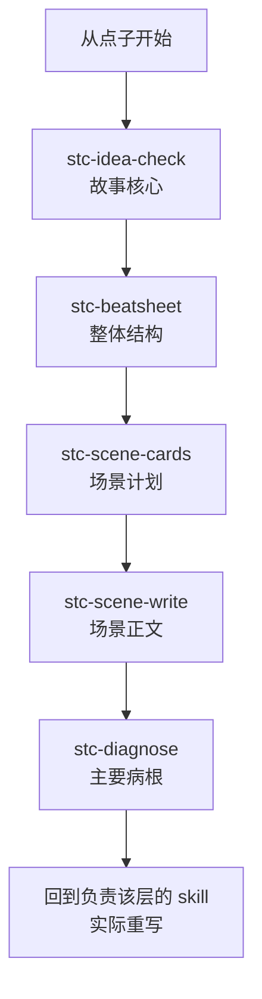

# 救猫咪故事创作 skill 套件

这套 skill 只有一个目的：**帮助用户把一个故事想清楚、写出来、改得更好。**

它不是为了跑完流程，也不是为了证明七个 skill 都被调用过。点子前提不成立时，应停在点子阶段；主角和主题没有想清楚时，不应继续填十五拍；诊断发现上游问题时，也不该先润色台词。

当前范围只到故事创作与改稿：

```text
点子 → 故事核心 → 整体结构 → 场景规划 → 场景正文 → 诊断与重写
```

分镜、Seedance 提示词和视频生成属于故事确认后的后续生产，不进入当前运行时 skill。

## 什么叫“把故事写好”

《救猫咪》没有提供一条保证成功的万能公式。这套件保留书中反复出现的几条创作主线：

- 找到最值得跟随的主角，让他面对最大冲突和最长的情感旅程。
- 给主角一个具体目标，并把表面愿望剥到普通人能本能理解的原始驱动力。
- 说清故事怎样开始、怎样结束，主角经历了什么真正变化。
- 让实体目标、精神目标和主题彼此关联，结尾用行动兑现。
- 用结构安排变化，用场景中的冲突和首尾转变推进故事。
- 写完后先回顾主干五问或三个世界，找到最值得先重写的地方。

如果一个故事只有设定、没有成立的原因；只有事件、没有人物变化；只有结构术语、没有让人想继续看的冲突，这套流程应该指出问题，而不是把它包装得更复杂。

## 从头问到尾：“原始吗？”

原书把“原始吗？”称为剧本创作和修改的试金石。它问的不是题材够不够低级或刺激，而是人物的表面目标能否继续向下追到人人都能理解的需要：

```text
表面目标 → 为什么非得到不可 → 失败会失去什么 → 原始驱动力
```

升职可以通向为孩子筹手术费，复杂交易可以通向生存、尊严或保护家庭。生存、被爱、寻找伙伴、保护所爱之人、保护家园和正义复仇都是原书举过的方向，但不是必须套用的封闭分类。

这条原则贯穿主角、对手、重要配角和次情节。完整定义只保存在 [`references/story-creation-contract.md`](references/story-creation-contract.md)；各 skill 只负责本阶段的用法，避免复制成七份清单。它也不能替代“故事前提是否成立”：一个目标可以很原始，故事设定仍然可能不合逻辑。

## 为什么拆成 7 个 skill

“写好一个故事”是共同目标，但点子、结构、分场、正文和改稿是不同的创作时刻。每个执行 skill 只交付一种产物，避免写正文时偷换主题，也避免诊断时直接重编整部作品。

| skill | 在什么时候使用 | 唯一任务 | 唯一交付物 |
|---|---|---|---|
| `stc-create` | 从零完整创作，或要求把现有作品真正改好 | 守住创作主线，编排阶段，诊断后组织实际重写 | 完整创作进度或改稿后的作品 |
| `stc-idea-check` | 只有方向、人物、设定或一句点子 | 把点子发展成站得住的故事核心 | 故事核心卡 |
| `stc-beatsheet` | 故事核心已经确认 | 把变化铺成三个世界和十五拍 | 结构大纲 |
| `stc-scene-cards` | 已有确认的大纲或节拍表 | 把整体结构拆成可逐场写作的计划 | 场景卡 |
| `stc-scene-write` | 已有场景卡或明确单场任务 | 把目标、冲突、行动和变化写成真正的戏 | 场景正文 |
| `stc-diagnose` | 已有完整作品或片段，只想找问题 | 用文本证据找到主要病根和修改顺序 | 改稿优先单 |
| `stc-first-aid` | 创作者本人卡住、想不出来 | 只给一种解卡方法和一个立即动作 | 一剂创作急救 |

`stc-idea-check` 为兼容旧调用保留原名，实际工作是“点子发展”，不是给点子打分。

## 总编排器负责什么

`stc-create` 不是没有创作判断的路由器。它负责确保每一阶段都在写同一个故事：

1. 观众主要跟随谁，为什么愿意继续跟随。
2. 主角遇到什么过不去的麻烦，想得到什么，表面目标背后有什么原始驱动力，谁在阻止。
3. 主角从什么状态走向什么状态，变化是否由行动和代价造成。
4. 故事最终在表达什么，结尾有没有兑现。

它不复制各子 skill 的具体方法，而是判断当前最该解决哪一层。流程有两条：



- 用户只要诊断：`stc-diagnose` 交付改稿单即结束。
- 用户要求“强势改稿”或“把它改好”：`stc-create` 先诊断，再调用对应创作 skill 执行修改，不能把诊断建议丢给用户自己施工。

## 各阶段怎样服务同一个故事

### 1. 点子发展：先判断前提是否成立

`stc-idea-check` 使用原书“理直故事主干的五个问题”：

1. 谁是主角？
2. 麻烦、难题是什么？
3. 故事怎样开始、怎样结束？
4. 实体目标和精神目标是什么？
5. 这部作品是关于什么的？

点子存在无理由的矛盾时，先指出来并停下；不靠增加世界设定把坏前提强行写成大纲。

### 2. 节拍结构：安排主角怎样变化

`stc-beatsheet` 使用三个世界和 BS2 十五拍，把故事核心铺成整体结构。十五拍是整部作品的结构节点，不等于十五场戏，也不要求为了填表增加十五件独立事件。

### 3. 场景规划：让每场推动故事

`stc-scene-cards` 依据原书索引卡方法，为每场确定一个主要冲突和一次首尾情绪或价值变化。即时目标、可见行动和退出后果是为了把卡片交给正文写作的工作字段。

### 4. 场景正文：把计划写成真正的戏

`stc-scene-write` 负责人物行动、现场对抗、潜台词、人物声音和场末变化。它交付剧本、短剧或小说场景正文，不负责下游制作。

### 5. 诊断与重写：先改最影响整部作品的地方

`stc-diagnose` 根据用户症状和文本证据选择一个主要重写入口：

- 故事讲谁、讲什么都不清楚 → 主干五问。
- 主角没有经历真正变化 → 三个世界。
- 故事核心清楚，但转折和整体推进有问题 → BS2 十五拍。
- 整体故事成立，但场景和对白不成立 → 场景与表达。

原书明确说，重写经常从主干五问或三个世界开始。诊断不需要每次把所有清单机械跑一遍。

## 两种常用入口

从零创作：

> 用 `stc-create` 把这个方向发展成完整故事，每个阶段让我确认。

对现有故事实际改稿：

> 用 `stc-create` 强势改这个故事。先找最根本的问题，然后直接重写，不要只给建议。

如果只缺某一步，可以直接调用对应执行 skill。

## 已作废的超级英雄实验

`evaluations/runs/2026-07-30-superhero-blind*` 保留了六轮同题实验，但它们不再是这套 skill 的有效盲测或好故事样例：

- 原始点子的关键前提没有先证明成立。
- 每轮之间修改了 skill，又重复使用同一道题，形成针对考题调参。
- 中间版本没有逐轮提交，无法严格复现。
- 由该题衍生的特殊能力、救援设备、专业权限和精确时间核验已从运行时 skill 删除。

这些文件只作为一次失败的开发记录，不能继续指导通用故事创作。下一轮验证应冻结 skill 版本，使用用户真实故事，测试结束后再区分单篇问题与通用问题。

## 后续路线

故事确认以后，未来可以分别建设：

```text
已确认的场景正文 → 独立分镜能力 → 独立 Seedance 提示词能力
```

分镜决定观众怎样看见，Seedance 提示词决定模型怎样执行。两者不反向进入当前故事创作 skill。

## 原文保护与出处

主要资料是《救猫咪》三部曲的 197 条微信读书划线、书评与个人想法，不是三本书全文。原始文件不复制到公开仓库，也不由本项目修改。

- [`references/source-ledger.md`](references/source-ledger.md)：方法行号、唯一主责、官方补充、整理者延伸和已废弃污染。
- [`references/story-creation-contract.md`](references/story-creation-contract.md)：跨阶段共同创作主线。
- `scripts/verify-source.sh /path/to/救猫咪三部曲.md`：只读核对原始文件哈希、行数和字节数。

方法标记：

- `[摘录]`：能在本地划线文件中核查。
- `[官方补充]`：摘录不足，另补自 Save the Cat 官方材料。
- `[整理者延伸]`：为了 AI 工作流或跨媒介迁移而增加，不能冒充作者原法则。

## 当前目录

```text
save-the-cat/
├── README.md
├── references/
├── evaluations/
├── scripts/
├── stc-create/
├── stc-idea-check/
├── stc-beatsheet/
├── stc-scene-cards/
├── stc-scene-write/
├── stc-diagnose/
└── stc-first-aid/
```
